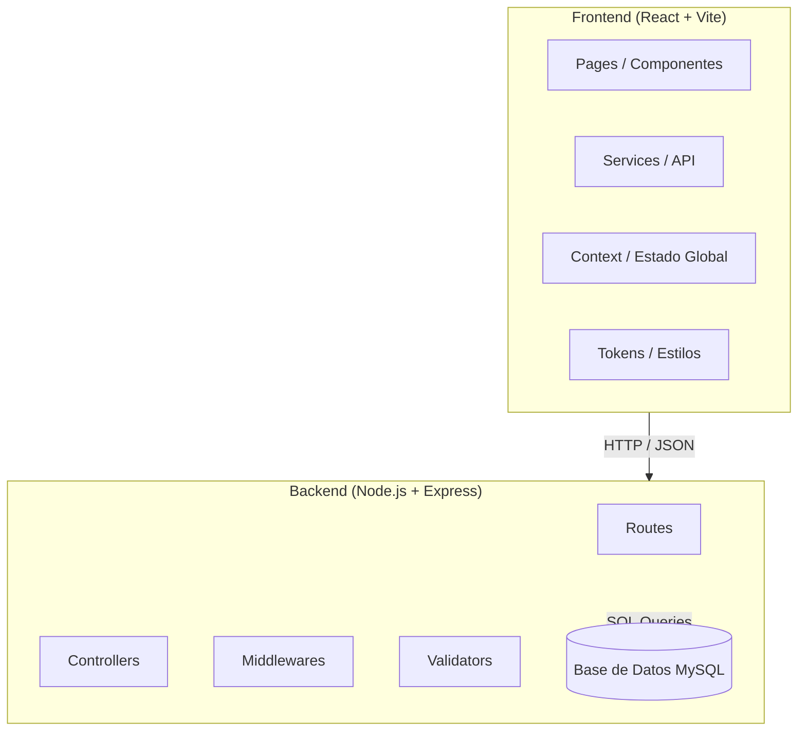
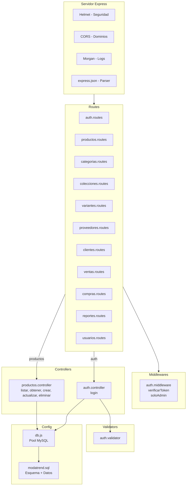
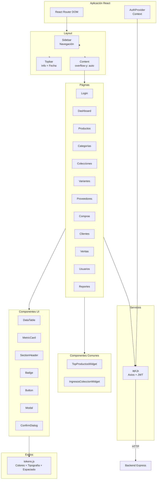
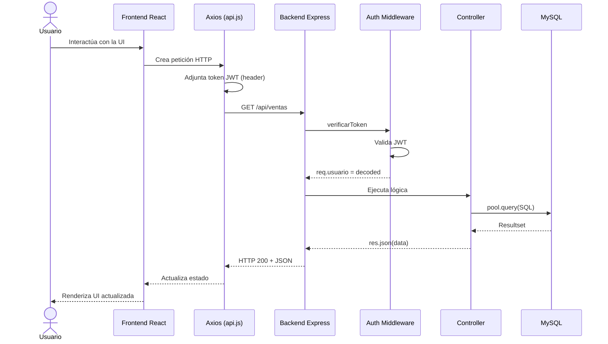

# Arquitectura MVC

## 1. Patrón de arquitectura

El sistema ModaTrend implementa el patrón **Modelo-Vista-Controlador (MVC)** distribuido en dos proyectos independientes: un **backend** (API REST) y un **frontend** (aplicación React). Esta separación permite el desarrollo independiente, el despliegue por separado y la reutilización de la API por múltiples clientes.

## 2. Diagrama de arquitectura general



## 3. Arquitectura del backend (API REST)



### 3.1 Estructura de directorios (backend)

```
backend/
├── src/
│   ├── config/
│   │   ├── db.js                    # Pool de conexiones MySQL
│   │   └── modatrend.sql            # Esquema y datos de prueba
│   ├── controllers/
│   │   ├── auth.controller.js       # Lógica de autenticación
│   │   └── productos.controller.js  # CRUD de productos
│   ├── middlewares/
│   │   └── auth.middleware.js        # JWT verification y roles
│   ├── routes/
│   │   ├── auth.routes.js           # POST /api/auth/login
│   │   ├── productos.routes.js      # CRUD productos
│   │   ├── categorias.routes.js     # CRUD categorías
│   │   ├── colecciones.routes.js    # CRUD colecciones
│   │   ├── variantes.routes.js      # CRUD variantes
│   │   ├── proveedores.routes.js    # CRUD proveedores
│   │   ├── clientes.routes.js       # CRUD clientes
│   │   ├── ventas.routes.js         # Ventas + detalle
│   │   ├── compras.routes.js        # Compras + detalle
│   │   ├── reportes.routes.js       # Dashboard + reportes
│   │   └── usuarios.routes.js       # CRUD usuarios
│   ├── validators/
│   │   └── auth.validator.js        # Validación de login
│   └── index.js                     # Punto de entrada
├── .env                             # Variables de entorno
└── package.json                     # Dependencias
```

### 3.2 Endpoints de la API

| Método | Ruta | Middleware | Descripción |
|--------|------|-----------|-------------|
| POST | `/api/auth/login` | validarLogin | Inicio de sesión |
| GET | `/api/productos` | verificarToken | Listar productos |
| GET | `/api/productos/:id` | verificarToken | Obtener producto |
| POST | `/api/productos` | verificarToken | Crear producto |
| PUT | `/api/productos/:id` | verificarToken | Actualizar producto |
| DELETE | `/api/productos/:id` | verificarToken | Desactivar producto |
| GET | `/api/categorias` | verificarToken | Listar categorías |
| POST | `/api/categorias` | verificarToken | Crear categoría |
| PUT | `/api/categorias/:id` | verificarToken | Actualizar categoría |
| DELETE | `/api/categorias/:id` | verificarToken | Eliminar categoría |
| GET | `/api/colecciones` | verificarToken | Listar colecciones |
| POST | `/api/colecciones` | verificarToken | Crear colección |
| PUT | `/api/colecciones/:id` | verificarToken | Actualizar colección |
| DELETE | `/api/colecciones/:id` | verificarToken | Eliminar colección |
| GET | `/api/variantes` | verificarToken | Listar variantes |
| POST | `/api/variantes` | verificarToken | Crear variante |
| PUT | `/api/variantes/:id` | verificarToken | Actualizar variante |
| DELETE | `/api/variantes/:id` | verificarToken | Eliminar variante |
| GET | `/api/proveedores` | verificarToken | Listar proveedores |
| POST | `/api/proveedores` | verificarToken | Crear proveedor |
| PUT | `/api/proveedores/:id` | verificarToken | Actualizar proveedor |
| DELETE | `/api/proveedores/:id` | verificarToken | Eliminar proveedor |
| GET | `/api/clientes` | verificarToken | Listar clientes |
| POST | `/api/clientes` | verificarToken | Crear cliente |
| PUT | `/api/clientes/:id` | verificarToken | Actualizar cliente |
| DELETE | `/api/clientes/:id` | verificarToken | Eliminar cliente |
| GET | `/api/ventas` | verificarToken | Listar ventas |
| GET | `/api/ventas/:id` | verificarToken | Obtener venta con detalle |
| POST | `/api/ventas` | verificarToken | Registrar venta |
| PUT | `/api/ventas/:id/estado` | verificarToken | Actualizar estado |
| PUT | `/api/ventas/:id/anular` | verificarToken | Anular venta |
| POST | `/api/ventas/saldo-favor` | verificarToken | Agregar saldo |
| GET | `/api/compras` | verificarToken | Listar compras |
| POST | `/api/compras` | verificarToken | Registrar compra |
| GET | `/api/reportes/dashboard` | verificarToken | KPIs del dashboard |
| GET | `/api/reportes/mas-vendidos` | verificarToken | Top 10 productos |
| GET | `/api/reportes/ingresos-coleccion` | verificarToken | Ingresos por colección |
| GET | `/api/reportes/tendencia-mensual` | verificarToken | Tendencia de ventas |
| GET | `/api/reportes/alertas-stock` | verificarToken | Alertas de inventario |
| GET | `/api/reportes/actividad-reciente` | verificarToken | Actividad del sistema |
| GET | `/api/reportes/por-vendedor` | verificarToken | Ventas por vendedor |
| GET | `/api/reportes/por-cliente` | verificarToken | Ventas por cliente |
| GET | `/api/reportes/exportar` | verificarToken | Exportar CSV |
| GET | `/api/usuarios` | verificarToken + soloAdmin | Listar usuarios |
| POST | `/api/usuarios` | verificarToken + soloAdmin | Crear usuario |
| PUT | `/api/usuarios/:id` | verificarToken + soloAdmin | Actualizar usuario |
| DELETE | `/api/usuarios/:id` | verificarToken + soloAdmin | Eliminar usuario |

## 4. Arquitectura del frontend (React)



### 4.1 Estructura de directorios (frontend)

```
frontend/
├── src/
│   ├── assets/
│   ├── components/
│   │   ├── common/
│   │   │   ├── TopProductosWidget.jsx   # Widget productos más vendidos
│   │   │   └── IngresosColeccionWidget.jsx # Widget ingresos por colección
│   │   ├── layout/
│   │   │   └── Layout.jsx              # Sidebar + Topbar + Content
│   │   └── ui/
│   │       ├── Badge.jsx               # Componente de etiqueta
│   │       ├── Button.jsx              # Botones reutilizables
│   │       ├── ConfirmDialog.jsx       # Diálogo de confirmación
│   │       ├── DataTable.jsx           # Tabla de datos genérica
│   │       ├── MetricCard.jsx          # Tarjeta de métrica KPI
│   │       ├── Modal.jsx               # Ventana modal
│   │       └── SectionHeader.jsx       # Encabezado de sección
│   ├── context/
│   │   └── AuthContext.jsx             # Estado global de autenticación
│   ├── pages/
│   │   ├── Login.jsx                   # Inicio de sesión
│   │   ├── Dashboard.jsx               # Panel de control principal
│   │   ├── Productos.jsx               # Gestión de productos
│   │   ├── Categorias.jsx              # Gestión de categorías
│   │   ├── Colecciones.jsx             # Gestión de colecciones
│   │   ├── Variantes.jsx               # Gestión de variantes
│   │   ├── Proveedores.jsx             # Gestión de proveedores
│   │   ├── Compras.jsx                 # Registro de compras
│   │   ├── Clientes.jsx                # Gestión de clientes
│   │   ├── Ventas.jsx                  # Registro de ventas
│   │   ├── Usuarios.jsx                # Gestión de usuarios
│   │   └── Reportes.jsx                # Reportes y análisis
│   ├── services/
│   │   └── api.js                      # Cliente Axios con JWT
│   ├── styles/
│   │   └── tokens.js                   # Sistema de diseño (DS)
│   ├── App.jsx                         # Enrutador principal
│   └── main.jsx                        # Punto de entrada
├── package.json
└── vite.config.js
```

## 5. Flujo de datos (Request-Response)



## 6. Sistema de diseño (Tokens)

El frontend implementa un sistema de diseño centralizado mediante el archivo `tokens.js`, que define:

### Colores

| Categoría | Colores |
|-----------|---------|
| **warm** | Tema claro: primary (#c47c5a), secondary (#f7e6d8), surface (#ffffff), background (#f5ede6) |
| **dark** | Tema oscuro: primary (#6366f1), secondary (#1e2030), surface (#13151f), background (#0f1117) |
| **accent** | Acentos: rose (#F78DA7), lilac (#BFA8F8), mint (#8FD9C8), blue (#8FC8FF) con sus variantes claro (roseBg, lilacBg, mintBg, blueBg) |

### Tipografía

| Nivel | Tamaño |
|-------|--------|
| caption | 12px |
| small | 13px |
| body | 14px |
| lead | 16px |
| h3 | 18px |
| h2 | 22px |
| h1 | 24px |
| display | 32px |
| kpi | 36px |

### Espaciado y bordes

| Token | xs | sm | md | lg | xl |
|-------|----|----|----|----|-----|
| spacing | 4px | 8px | 16px | 24px | 40px |
| radius | 6px | 10px | 16px | 20px | 50% |

## 7. Seguridad

El sistema implementa las siguientes medidas de seguridad:

| Medida | Implementación |
|--------|---------------|
| Contraseñas hasheadas | bcryptjs con 10 rondas de sal |
| Autenticación JWT | Token firmado con `JWT_SECRET`, expiración configurable (8h por defecto) |
| Middleware de protección | `verificarToken` en todas las rutas excepto login |
| Roles de acceso | `soloAdmin` para rutas sensibles (gestión de usuarios) |
| Cabeceras de seguridad | Helmet para protección contra ataques web comunes |
| CORS | Origen restringido a `CLIENT_URL` (http://localhost:5173) |
| Descuento máximo | Validación del 50% máximo en ventas |
| Precio mínimo | Validación de precio venta ≥ precio costo |
| Transacciones | Uso de `beginTransaction`/`commit`/`rollback` en ventas y compras |
