# Evidencias de Funcionamiento

## Login

---

## Dashboard

Captura principal:

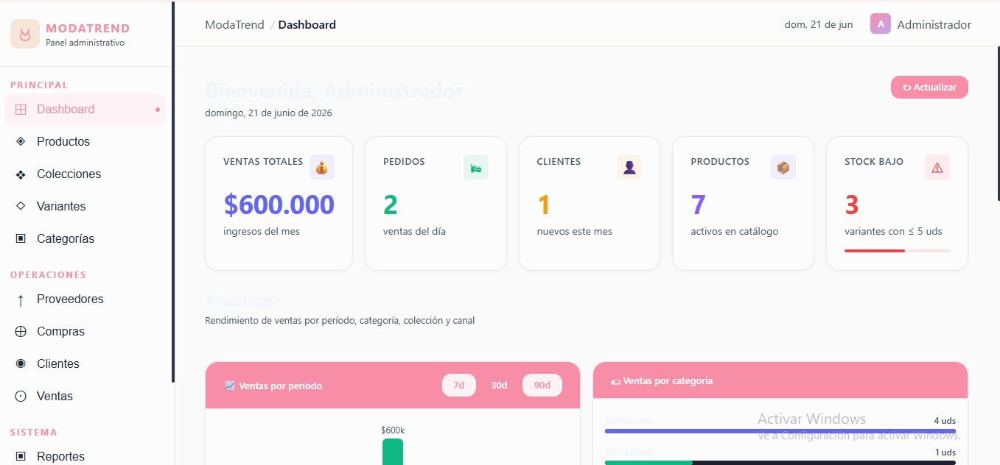

Captura secundaria:

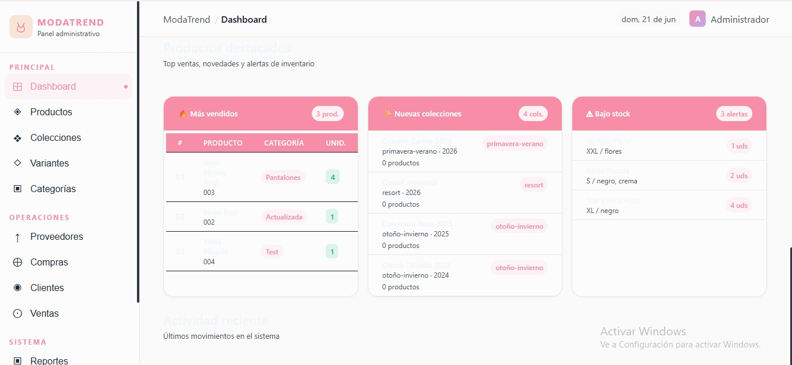

---

## Productos

Listado:

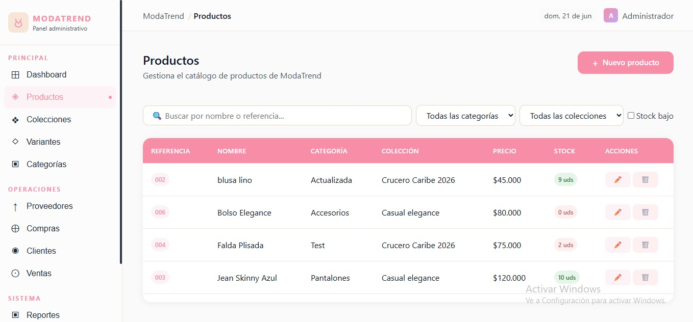

Formulario:

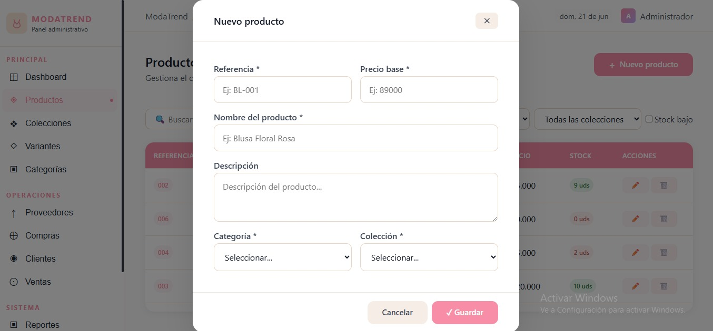

---

## Categorías

Listado:

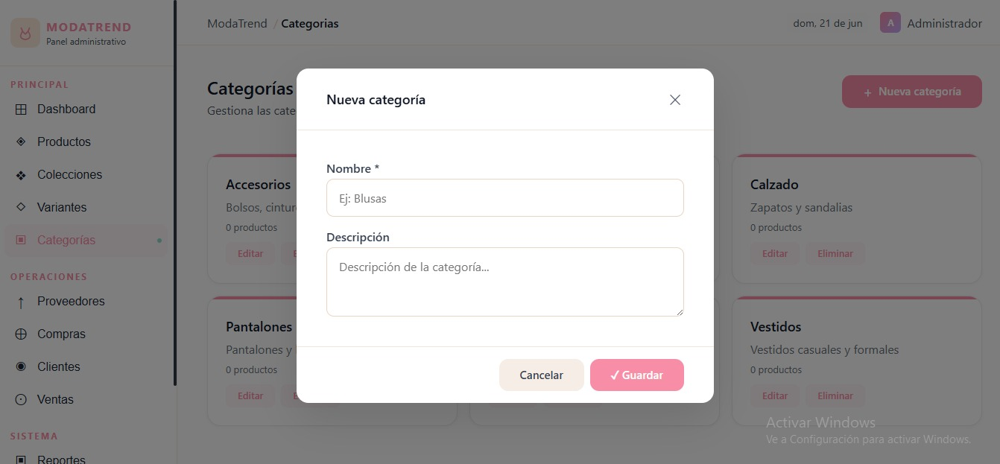

Formulario:

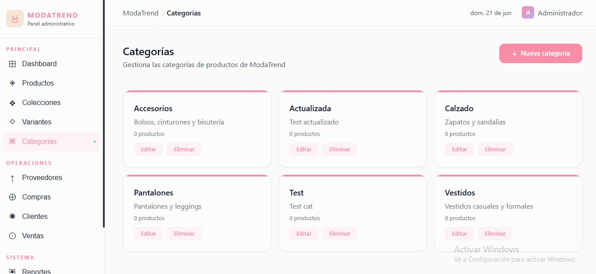

---

## Colecciones

Listado:

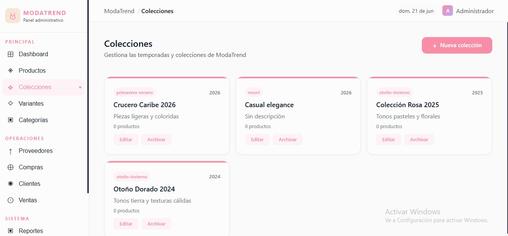

Formulario:

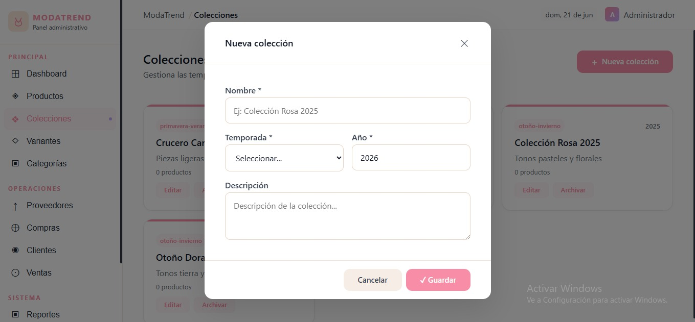

---

## Variantes

Listado:

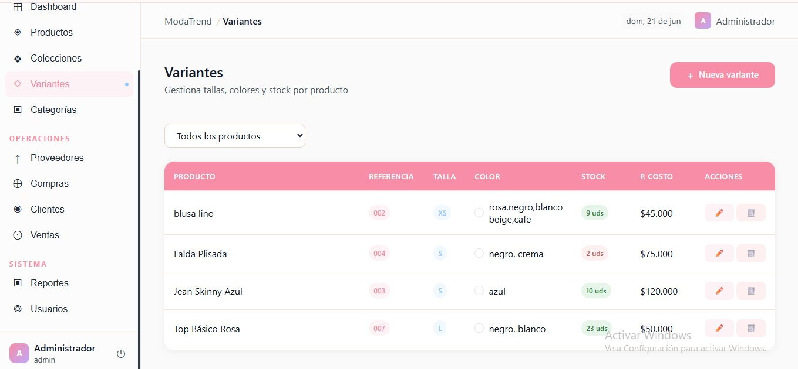

Formulario:

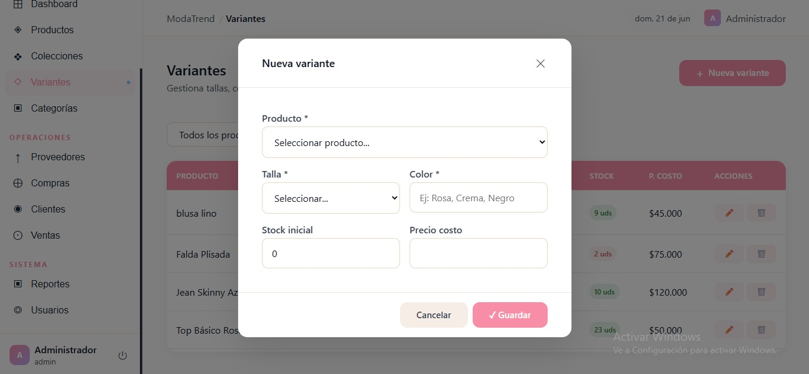

---

## Proveedores

Listado:

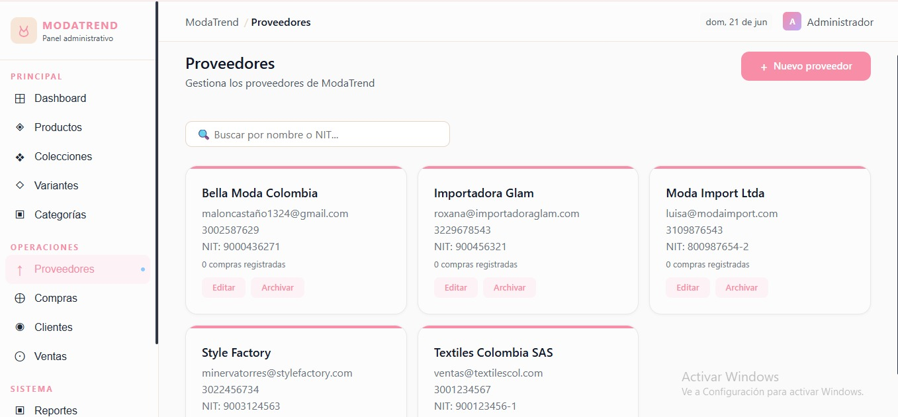

Formulario:

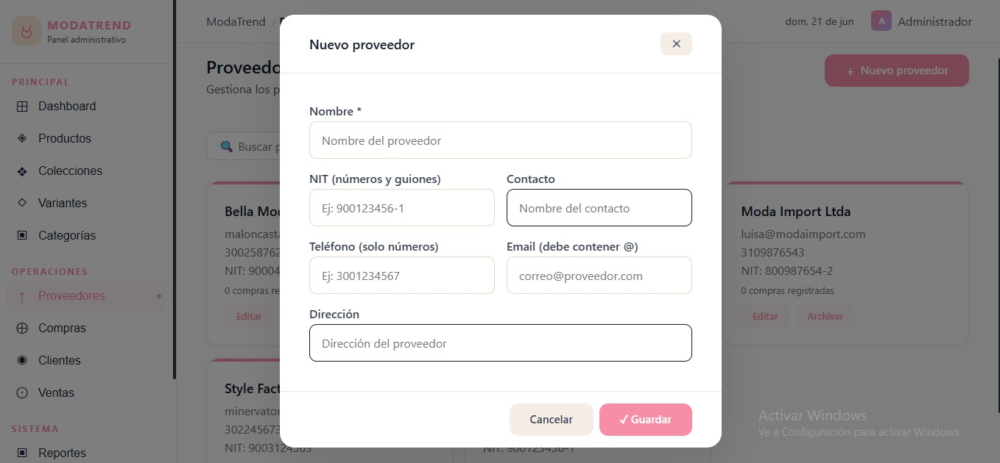

---

## Compras

Listado:

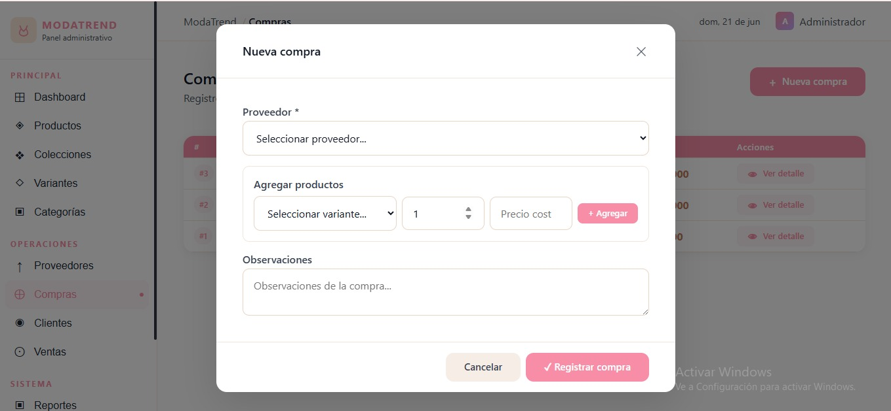

Formulario:

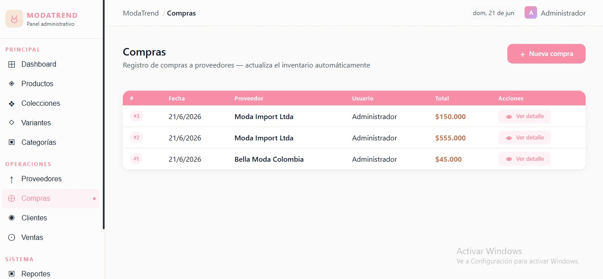

---

## Clientes

Listado:

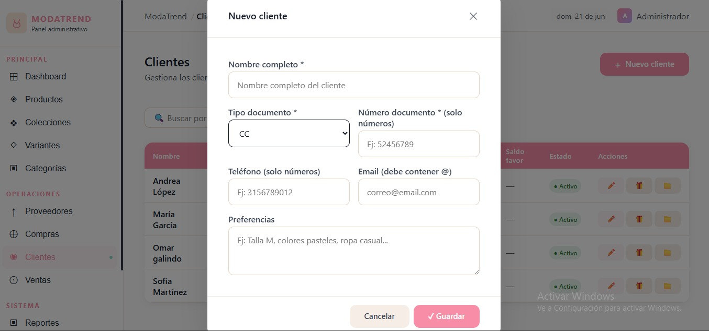

Formulario:

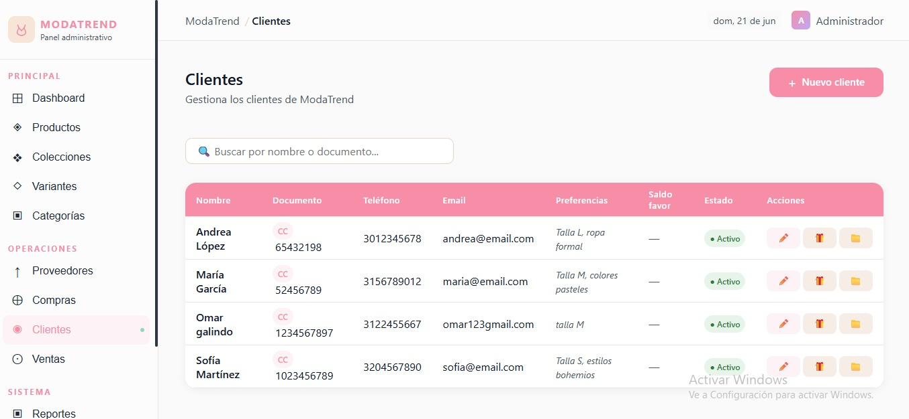

---

## Ventas

Listado:

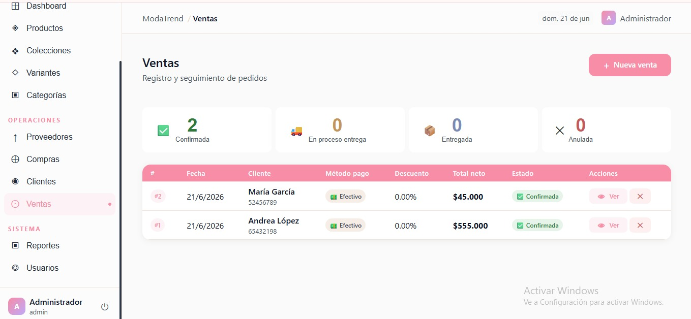

Formulario:

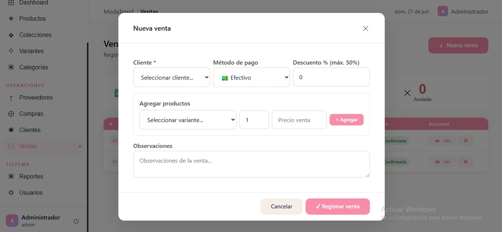

---

## Usuarios

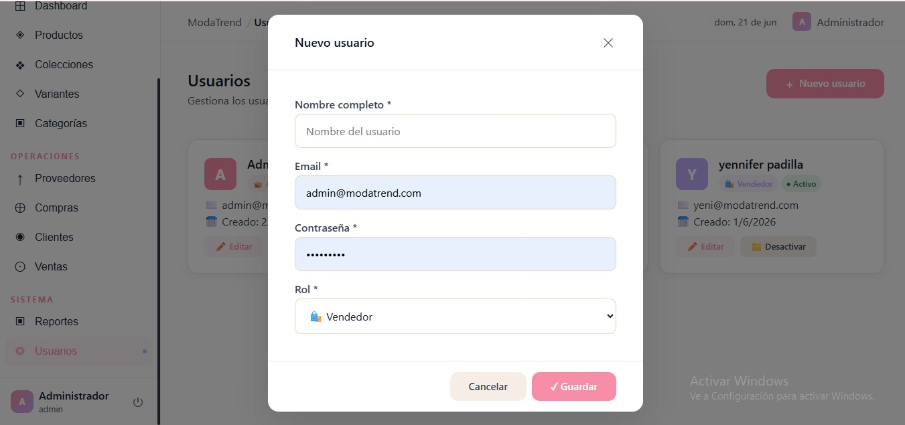

Formulario:

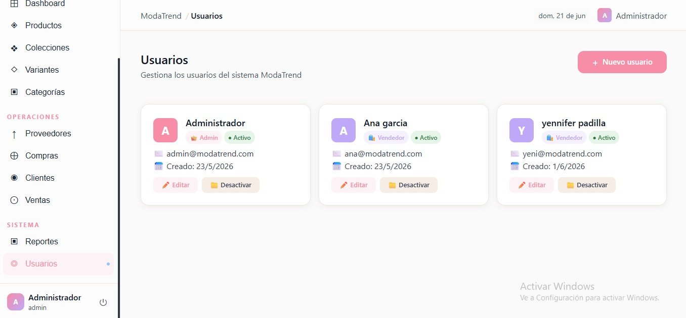

---

## Reportes

Listado:

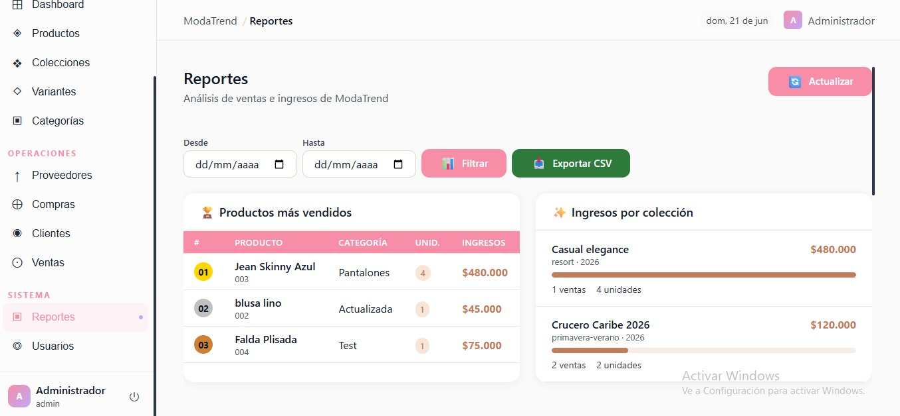

Captura adicional:

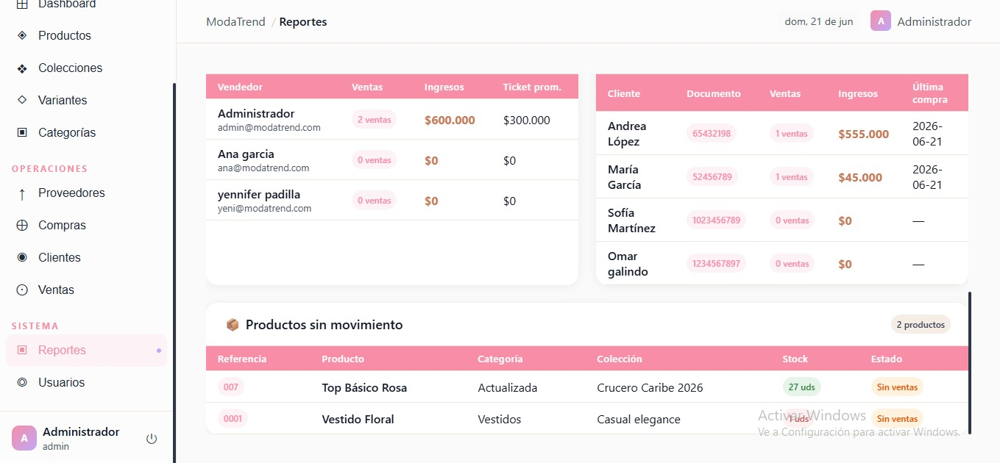
