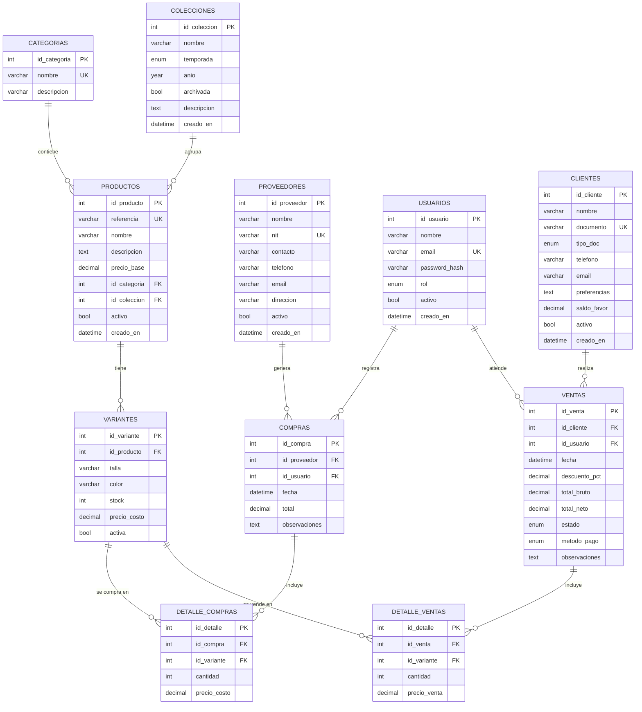

# Modelo Entidad-Relación (MER)

## 1. Diagrama Entidad-Relación

## 2. Diccionario de entidades

### 2.1 Categorías
Entidad que representa las clasificaciones de los productos. Ejemplo: Blusas, Pantalones, Vestidos. Cada categoría tiene un nombre único.

**Atributos:**
- `id_categoria`: identificador único autoincremental.
- `nombre`: nombre de la categoría (único, longitud máxima 80 caracteres).
- `descripcion`: descripción opcional de la categoría.

### 2.2 Colecciones
Entidad que agrupa productos por temporada y año. Ejemplo: "Colección Rosa 2025", "Otoño Dorado 2024".

**Atributos:**
- `id_coleccion`: identificador único autoincremental.
- `nombre`: nombre de la colección.
- `temporada`: temporada (`primavera-verano`, `otoño-invierno`, `crucero`, `resort`).
- `anio`: año de la colección.
- `archivada`: indica si la colección está archivada (no permite nuevos productos).
- `descripcion`: texto descriptivo opcional.
- `creado_en`: fecha de creación automática.

### 2.3 Productos
Entidad principal del catálogo. Cada producto pertenece a una categoría y una colección.

**Atributos:**
- `id_producto`: identificador único autoincremental.
- `referencia`: código único de referencia del producto.
- `nombre`: nombre comercial del producto.
- `descripcion`: descripción detallada del producto.
- `precio_base`: precio base de venta.
- `id_categoria`: llave foránea a la tabla `categorias`.
- `id_coleccion`: llave foránea a la tabla `colecciones`.
- `activo`: indica si el producto está activo en el catálogo.
- `creado_en`: fecha de creación automática.

### 2.4 Variantes
Entidad que representa las versiones específicas de un producto, definidas por una combinación única de talla y color.

**Atributos:**
- `id_variante`: identificador único autoincremental.
- `id_producto`: llave foránea a la tabla `productos`.
- `talla`: talla de la variante (XS, S, M, L, XL, XXL, 36-42, U).
- `color`: color de la variante.
- `stock`: cantidad disponible en inventario.
- `precio_costo`: precio de adquisición de la variante.
- `activa`: indica si la variante está activa.

**Restricción:** La combinación `(id_producto, talla, color)` es única.

### 2.5 Proveedores
Entidad que representa a los proveedores que suministran productos a la tienda.

**Atributos:**
- `id_proveedor`: identificador único autoincremental.
- `nombre`: nombre del proveedor.
- `nit`: NIT del proveedor (único).
- `contacto`: nombre de la persona de contacto.
- `telefono`: número de teléfono.
- `email`: dirección de correo electrónico.
- `direccion`: dirección física.
- `activo`: indica si el proveedor está activo.
- `creado_en`: fecha de creación automática.

### 2.6 Compras
Entidad que representa las transacciones de compra de inventario a proveedores.

**Atributos:**
- `id_compra`: identificador único autoincremental.
- `id_proveedor`: llave foránea a la tabla `proveedores`.
- `id_usuario`: llave foránea a la tabla `usuarios` (usuario que registró la compra).
- `fecha`: fecha y hora de la compra.
- `total`: valor total de la compra.
- `observaciones`: notas adicionales.

### 2.7 Detalle de compras
Entidad intermedia que relaciona compras con variantes (relación N:M).

**Atributos:**
- `id_detalle`: identificador único autoincremental.
- `id_compra`: llave foránea a la tabla `compras`.
- `id_variante`: llave foránea a la tabla `variantes`.
- `cantidad`: cantidad comprada de la variante.
- `precio_costo`: precio de costo unitario al momento de la compra.

### 2.8 Clientes
Entidad que representa a los compradores finales.

**Atributos:**
- `id_cliente`: identificador único autoincremental.
- `nombre`: nombre completo del cliente.
- `documento`: número de documento de identidad (único).
- `tipo_doc`: tipo de documento (CC, CE, NIT, PAS).
- `telefono`: número de teléfono.
- `email`: correo electrónico.
- `preferencias`: preferencias de compra (talla, estilo, etc.).
- `saldo_favor`: saldo a favor disponible para futuras compras.
- `activo`: indica si el cliente está activo.
- `creado_en`: fecha de registro.

### 2.9 Ventas
Entidad que representa las transacciones de venta a clientes.

**Atributos:**
- `id_venta`: identificador único autoincremental.
- `id_cliente`: llave foránea a la tabla `clientes`.
- `id_usuario`: llave foránea a la tabla `usuarios` (vendedor).
- `fecha`: fecha y hora de la venta.
- `descuento_pct`: porcentaje de descuento aplicado (máximo 50%).
- `total_bruto`: suma de precios de venta antes del descuento.
- `total_neto`: total final después del descuento.
- `estado`: estado del pedido (`confirmada`, `en_entrega`, `entregada`, `anulada`).
- `metodo_pago`: método de pago (`efectivo`, `tarjeta`, `credito`, `saldo_favor`).
- `observaciones`: notas adicionales.

### 2.10 Detalle de ventas
Entidad intermedia que relaciona ventas con variantes (relación N:M).

**Atributos:**
- `id_detalle`: identificador único autoincremental.
- `id_venta`: llave foránea a la tabla `ventas`.
- `id_variante`: llave foránea a la tabla `variantes`.
- `cantidad`: cantidad vendida de la variante.
- `precio_venta`: precio de venta unitario.

### 2.11 Usuarios
Entidad que representa a las personas que acceden al sistema.

**Atributos:**
- `id_usuario`: identificador único autoincremental.
- `nombre`: nombre completo del usuario.
- `email`: correo electrónico (único, usado para inicio de sesión).
- `password_hash`: hash de la contraseña (bcrypt).
- `rol`: rol del usuario (`admin`, `vendedor`).
- `activo`: indica si el usuario está activo.
- `creado_en`: fecha de creación.

## 3. Explicación de las relaciones

### Relaciones 1:N (uno a muchos)

| Relación | Explicación |
|----------|-------------|
| Categorías → Productos | Una categoría puede contener muchos productos, pero un producto pertenece a una sola categoría. |
| Colecciones → Productos | Una colección puede agrupar muchos productos, pero un producto pertenece a una sola colección. |
| Productos → Variantes | Un producto puede tener muchas variantes (talla/color), pero cada variante pertenece a un solo producto. |
| Proveedores → Compras | Un proveedor puede recibir muchas órdenes de compra, pero cada compra se realiza a un solo proveedor. |
| Usuarios → Compras | Un usuario puede registrar muchas compras, pero cada compra es registrada por un solo usuario. |
| Usuarios → Ventas | Un usuario (vendedor) puede atender muchas ventas, pero cada venta es atendida por un solo vendedor. |
| Clientes → Ventas | Un cliente puede realizar muchas compras, pero cada venta corresponde a un solo cliente. |

### Relaciones N:M (muchos a muchos)

| Relación | Explicación |
|----------|-------------|
| Compras ↔ Variantes | Una compra puede incluir múltiples variantes, y una variante puede ser comprada en múltiples ocasiones. Esta relación se resuelve mediante la tabla intermedia `detalle_compras`, que además almacena la cantidad y el precio de costo. |
| Ventas ↔ Variantes | Una venta puede incluir múltiples variantes, y una variante puede ser vendida en múltiples ventas. Esta relación se resuelve mediante la tabla intermedia `detalle_ventas`, que además almacena la cantidad y el precio de venta. |
