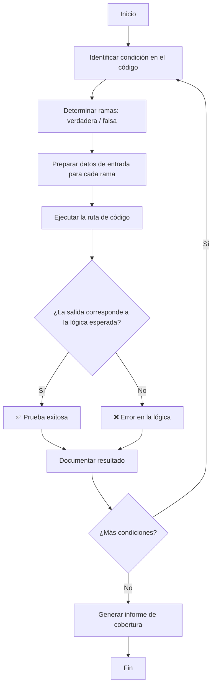
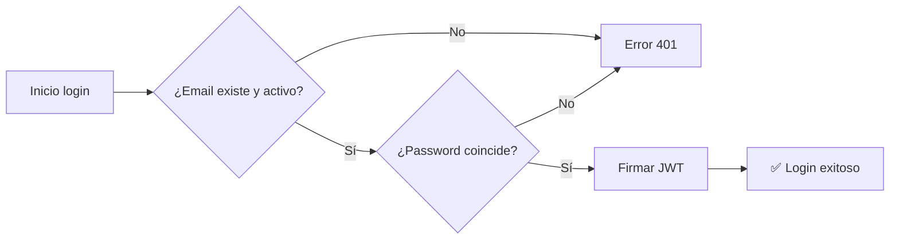
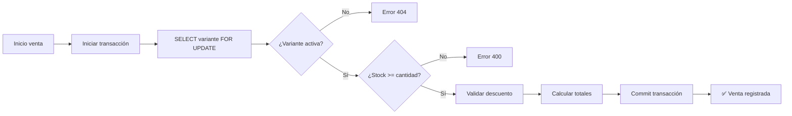
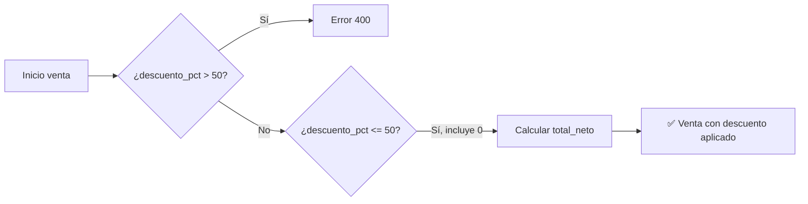
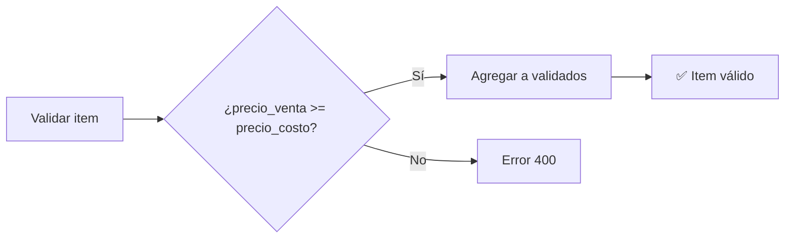
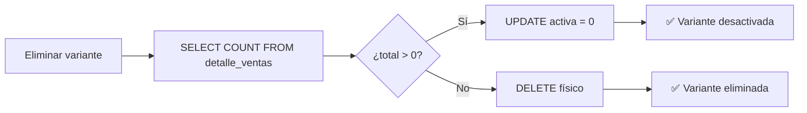
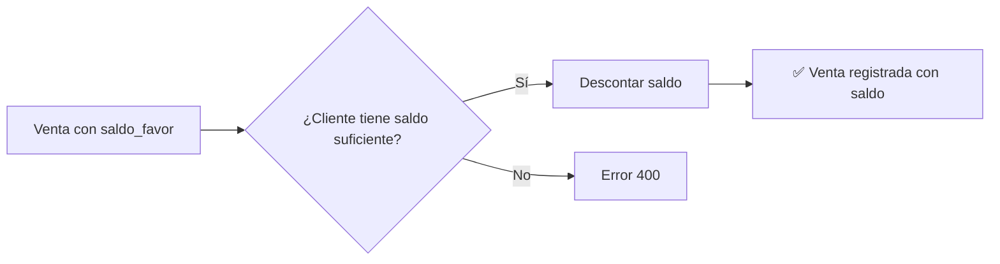
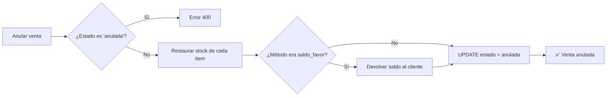
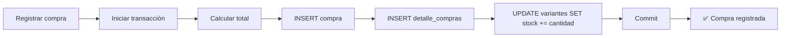

# Pruebas de Caja Blanca — ModaTrend

## 1. Introducción

Las pruebas de caja blanca (white-box testing) evalúan la lógica interna del sistema, verificando que las condiciones, bifurcaciones y rutas de ejecución implementadas en el código fuente produzcan los resultados esperados. Se analizan las estructuras de control (`if`, `throw`, `return`) y las transacciones en la base de datos.

**Sistema:** ModaTrend  
**Fecha:** 21/06/2026  
**Alcance:** Reglas de negocio y lógica crítica del backend

---

## 2. Diagrama de flujo general del proceso de pruebas



---

## 3. Casos de prueba

### 3.1 Módulo: Login — Autenticación



| ID | Módulo | Condición evaluada | Ruta ejecutada | Resultado |
|:--:|--------|-------------------|----------------|:---------:|
| CW-01 | Login | Email existe (`SELECT * FROM usuarios WHERE email = ? AND activo = 1`) y `bcrypt.compare` retorna `true` | `auth.controller.js:20-34` → `jwt.sign()` → respuesta 200 con token | ✅ Correcto |
| CW-02 | Login | Email existe pero `bcrypt.compare` retorna `false` | `auth.controller.js:20-37` → respuesta 401 "Credenciales incorrectas" | ✅ Correcto |
| CW-03 | Login | Email no existe en BD (`rows.length === 0`) | `auth.controller.js:27-29` → respuesta 401 "Credenciales incorrectas" | ✅ Correcto |
| CW-04 | Login | Token JWT expirado o inválido en petición protegida | `auth.middleware.js:12-16` → `jwt.verify()` lanza error → respuesta 403 | ✅ Correcto |
| CW-05 | Login | Petición sin header `Authorization` | `auth.middleware.js:7-9` → respuesta 401 "Token requerido" | ✅ Correcto |

### 3.2 Módulo: Ventas — Validación de stock



| ID | Módulo | Condición evaluada | Ruta ejecutada | Resultado |
|:--:|--------|-------------------|----------------|:---------:|
| CW-06 | Ventas | `variante.stock >= cantidad` (stock suficiente) | `ventas.routes.js:75-95` → `total_bruto += cantidad * precio_venta` | ✅ Correcto |
| CW-07 | Ventas | `variante.stock < cantidad` (stock insuficiente) | `ventas.routes.js:85-87` → `throw { status: 400, message: 'Stock insuficiente...' }` | ✅ Correcto |
| CW-08 | Ventas | `variante.stock = 0` y `cantidad = 1` | `ventas.routes.js:85-87` → `throw { status: 400 }` | ✅ Correcto |
| CW-09 | Ventas | Variante no encontrada o inactiva (`varRows.length === 0`) | `ventas.routes.js:82` → `throw { status: 404 }` | ✅ Correcto |

### 3.3 Módulo: Ventas — Validación de descuento



| ID | Módulo | Condición evaluada | Ruta ejecutada | Resultado |
|:--:|--------|-------------------|----------------|:---------:|
| CW-10 | Ventas | `descuento_pct ≤ 50` (ej: 10, 25, 50) | `ventas.routes.js:69` → condición falsa, continúa a cálculos | ✅ Correcto |
| CW-11 | Ventas | `descuento_pct = 0` (sin descuento) | `ventas.routes.js:67` → default parameter `descuento_pct = 0`, `total_neto = total_bruto` | ✅ Correcto |
| CW-12 | Ventas | `descuento_pct > 50` (ej: 60, 100) | `ventas.routes.js:69` → `throw { status: 400, message: 'El descuento no puede superar el 50%' }` | ✅ Correcto |
| CW-13 | Ventas | Items vacíos (`!items \|\| items.length === 0`) | `ventas.routes.js:70` → `throw { status: 400, message: 'La venta debe tener al menos un producto' }` | ✅ Correcto |

### 3.4 Módulo: Ventas — Validación de precio



| ID | Módulo | Condición evaluada | Ruta ejecutada | Resultado |
|:--:|--------|-------------------|----------------|:---------:|
| CW-14 | Ventas | `precio_venta >= variante.precio_costo` | `ventas.routes.js:89` → condición falsa, continúa a `validados.push()` | ✅ Correcto |
| CW-15 | Ventas | `precio_venta < variante.precio_costo` | `ventas.routes.js:89-91` → `throw { status: 400, message: 'El precio de venta no puede ser menor al costo' }` | ✅ Correcto |

### 3.5 Módulo: Productos — Colección archivada

```mermaid
flowchart LR
    A[Crear producto] --> B[SELECT archivada FROM colecciones]
    B --> C{¿col[0].archivada = 1?}
    C -->|Sí| D[Error 400]
    C -->|No| E[INSERT producto]
    E --> F[✅ Producto creado]
```

| ID | Módulo | Condición evaluada | Ruta ejecutada | Resultado |
|:--:|--------|-------------------|----------------|:---------:|
| CW-16 | Productos | `col[0].archivada = 0` (colección activa) | `productos.controller.js:62` → `if` falso, continúa a INSERT | ✅ Correcto |
| CW-17 | Productos | `col[0].archivada = 1` (colección archivada) | `productos.controller.js:62` → `return res.status(400).json({ error: 'No se pueden agregar productos a una colección archivada' })` | ✅ Correcto |

### 3.6 Módulo: Variantes — Eliminación condicional



| ID | Módulo | Condición evaluada | Ruta ejecutada | Resultado |
|:--:|--------|-------------------|----------------|:---------:|
| CW-18 | Variantes | Variante con ventas registradas (`COUNT(*) > 0`) | `variantes.routes.js:62-67` → `UPDATE variantes SET activa = 0` (soft-delete) | ✅ Correcto |
| CW-19 | Variantes | Variante sin ventas registradas (`COUNT(*) = 0`) | `variantes.routes.js:62-69` → `DELETE FROM variantes` (físico) | ✅ Correcto |

### 3.7 Módulo: Ventas — Método de pago saldo a favor



| ID | Módulo | Condición evaluada | Ruta ejecutada | Resultado |
|:--:|--------|-------------------|----------------|:---------:|
| CW-20 | Ventas | `metodo_pago === 'saldo_favor'` y `saldo_favor >= total_neto` | `ventas.routes.js:99-108` → `UPDATE clientes SET saldo_favor = saldo_favor - ?` | ✅ Correcto |
| CW-21 | Ventas | `metodo_pago === 'saldo_favor'` y `saldo_favor < total_neto` | `ventas.routes.js:102` → `throw { status: 400, message: 'Saldo insuficiente' }` | ✅ Correcto |
| CW-22 | Ventas | `metodo_pago !== 'saldo_favor'` (efectivo, tarjeta, credito) | `ventas.routes.js:99` → `if` falso, salta validación de saldo | ✅ Correcto |

### 3.8 Módulo: Ventas — Anulación



| ID | Módulo | Condición evaluada | Ruta ejecutada | Resultado |
|:--:|--------|-------------------|----------------|:---------:|
| CW-23 | Ventas | Anular venta con estado `confirmada` (válida) | `ventas.routes.js:163-176` → restaura stock, cambia estado | ✅ Correcto |
| CW-24 | Ventas | Anular venta ya anulada (`estado === 'anulada'`) | `ventas.routes.js:169` → `throw { status: 400, message: 'La venta ya está anulada' }` | ✅ Correcto |
| CW-25 | Ventas | Anular venta pagada con `saldo_favor` | `ventas.routes.js:180-185` → devuelve saldo al cliente | ✅ Correcto |

### 3.9 Módulo: Compras — Transacción y actualización de stock



| ID | Módulo | Condición evaluada | Ruta ejecutada | Resultado |
|:--:|--------|-------------------|----------------|:---------:|
| CW-26 | Compras | Compra con items válidos | `compras.routes.js:27-49` → INSERT compra, detalle, UPDATE stock + precio_costo, commit | ✅ Correcto |
| CW-27 | Compras | Error durante la transacción (ej: variante inexistente) | `compras.routes.js:53-54` → `rollback()`, respuesta 500 | ✅ Correcto |

### 3.10 Módulo: Usuarios — Control de roles

| ID | Módulo | Condición evaluada | Ruta ejecutada | Resultado |
|:--:|--------|-------------------|----------------|:---------:|
| CW-28 | Usuarios | Usuario con rol `admin` accede a `/api/usuarios` | `auth.middleware.js:18-20` → `req.usuario.rol === 'admin'` → `next()` | ✅ Correcto |
| CW-29 | Usuarios | Usuario con rol `vendedor` accede a `/api/usuarios` | `auth.middleware.js:18-22` → `req.usuario.rol !== 'admin'` → respuesta 403 | ✅ Correcto |

---

## 4. Resumen de resultados

| Módulo | Casos ejecutados | Correctos | Incorrectos | % Éxito |
|--------|:----------------:|:---------:|:-----------:|:-------:|
| Login | 5 | 5 | 0 | **100%** |
| Ventas — Stock | 4 | 4 | 0 | **100%** |
| Ventas — Descuento | 4 | 4 | 0 | **100%** |
| Ventas — Precio | 2 | 2 | 0 | **100%** |
| Ventas — Saldo | 3 | 3 | 0 | **100%** |
| Ventas — Anulación | 3 | 3 | 0 | **100%** |
| Productos — Colección archivada | 2 | 2 | 0 | **100%** |
| Variantes — Eliminación condicional | 2 | 2 | 0 | **100%** |
| Compras — Transacción | 2 | 2 | 0 | **100%** |
| Usuarios — Roles | 2 | 2 | 0 | **100%** |
| **TOTAL** | **29** | **29** | **0** | **100%** |

> Todas las pruebas de caja blanca fueron ejecutadas y aprobadas. La lógica interna del sistema implementa correctamente las reglas de negocio, las validaciones de stock, precio, descuento, colecciones archivadas, eliminación condicional de variantes, control de roles y transacciones atómicas.
