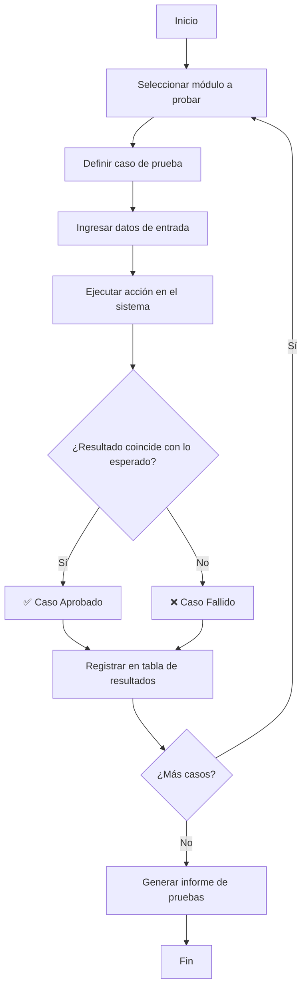

# Pruebas de Caja Negra — ModaTrend

## 1. Introducción

Las pruebas de caja negra (black-box testing) se realizan sobre la interfaz del sistema sin conocer la estructura interna del código. Se centran en verificar que el sistema responde correctamente a las entradas y produce las salidas esperadas según los requisitos funcionales.

**Sistema:** ModaTrend  
**Fecha:** 21/06/2026  
**Alcance:** Funcionalidades core (Login, Productos, Variantes, Colecciones, Compras, Clientes, Ventas, Usuarios, Reportes)

---

## 2. Diagrama de flujo general del proceso de pruebas

---

## 3. Plan de pruebas

### 3.1 Módulo: Login

| ID | Módulo | Entrada | Resultado esperado | Resultado obtenido | Estado |
|:--:|--------|---------|-------------------|:------------------:|:------:|
| CB-01 | Login | Email: `admin@modatrend.com`, Contraseña: `(válida)` | Token JWT, datos del usuario, redirección a Dashboard | Correcto | ✅ Aprobado |
| CB-02 | Login | Email: `admin@modatrend.com`, Contraseña: `incorrecta123` | Error 401: "Credenciales incorrectas" | Correcto | ✅ Aprobado |
| CB-03 | Login | Email: ``, Contraseña: `` | Error 422: validación de campos obligatorios | Correcto | ✅ Aprobado |
| CB-04 | Login | Email: `correo-invalido`, Contraseña: `123456` | Error 422: formato de email inválido | Correcto | ✅ Aprobado |
| CB-05 | Login | Email: `noexiste@test.com`, Contraseña: `123456` | Error 401: "Credenciales incorrectas" | Correcto | ✅ Aprobado |

### 3.2 Módulo: Productos

| ID | Módulo | Entrada | Resultado esperado | Resultado obtenido | Estado |
|:--:|--------|---------|-------------------|:------------------:|:------:|
| CB-06 | Productos | Nombre: `Blusa Floral`, Referencia: `BFR-001`, Precio: `45000`, Categoría: `1`, Colección: `1` | Producto creado con ID, respuesta 201 | Correcto | ✅ Aprobado |
| CB-07 | Productos | Referencia duplicada: `ACC01` | Error 409: "La referencia ya existe" | Correcto | ✅ Aprobado |
| CB-08 | Productos | Actualizar precio: `20000` → `25000` | Producto actualizado, respuesta 200 | Correcto | ✅ Aprobado |
| CB-09 | Productos | Eliminar producto activo | Soft-delete: `activo = 0`, respuesta 200 | Correcto | ✅ Aprobado |
| CB-10 | Productos | Producto sin stock, filtrar por `stock_bajo=1` | Producto listado en resultados (stock ≤ 5) | Correcto | ✅ Aprobado |

### 3.3 Módulo: Variantes

| ID | Módulo | Entrada | Resultado esperado | Resultado obtenido | Estado |
|:--:|--------|---------|-------------------|:------------------:|:------:|
| CB-11 | Variantes | Producto: `1`, Talla: `M`, Color: `Rosa`, Stock: `10`, Costo: `15000` | Variante creada, respuesta 201 | Correcto | ✅ Aprobado |
| CB-12 | Variantes | Mismo producto + talla + color duplicado | Error por combinación única `(id_producto, talla, color)` | Correcto | ✅ Aprobado |
| CB-13 | Variantes | Stock: `0`, consultar listado | Variante visible con stock 0 | Correcto | ✅ Aprobado |
| CB-14 | Variantes | Eliminar variante sin ventas | DELETE físico, respuesta 200 | Correcto | ✅ Aprobado |
| CB-15 | Variantes | Eliminar variante con ventas registradas | Soft-delete: `activa = 0`, respuesta 200 | Correcto | ✅ Aprobado |

### 3.4 Módulo: Colecciones

| ID | Módulo | Entrada | Resultado esperado | Resultado obtenido | Estado |
|:--:|--------|---------|-------------------|:------------------:|:------:|
| CB-16 | Colecciones | Nombre: `Verano 2027`, Temporada: `primavera-verano`, Año: `2027` | Colección creada, respuesta 201 | Correcto | ✅ Aprobado |
| CB-17 | Colecciones | Archivar colección existente | `archivada = 1`, respuesta 200 | Correcto | ✅ Aprobado |
| CB-18 | Colecciones | Intentar asociar producto a colección archivada | Error 400: "No se pueden agregar productos a una colección archivada" | Correcto | ✅ Aprobado |

### 3.5 Módulo: Compras

| ID | Módulo | Entrada | Resultado esperado | Resultado obtenido | Estado |
|:--:|--------|---------|-------------------|:------------------:|:------:|
| CB-19 | Compras | Proveedor: `1`, Items: `{id_variante: 1, cantidad: 5, precio_costo: 12000}` | Compra registrada, stock actualizado, respuesta 201 | Correcto | ✅ Aprobado |
| CB-20 | Compras | Verificar stock tras compra | `stock = stock_anterior + cantidad_comprada` | Correcto | ✅ Aprobado |
| CB-21 | Compras | Verificar precio_costo tras compra | `precio_costo` actualizado al valor de la compra | Correcto | ✅ Aprobado |

### 3.6 Módulo: Clientes

| ID | Módulo | Entrada | Resultado esperado | Resultado obtenido | Estado |
|:--:|--------|---------|-------------------|:------------------:|:------:|
| CB-22 | Clientes | Nombre: `Laura Pérez`, Documento: `123456789`, Teléfono: `3001112233` | Cliente creado, respuesta 201 | Correcto | ✅ Aprobado |
| CB-23 | Clientes | Documento duplicado | Error por UNIQUE en `documento` | Correcto | ✅ Aprobado |
| CB-24 | Clientes | Desactivar cliente existente | `activo = 0`, respuesta 200 | Correcto | ✅ Aprobado |

### 3.7 Módulo: Ventas

| ID | Módulo | Entrada | Resultado esperado | Resultado obtenido | Estado |
|:--:|--------|---------|-------------------|:------------------:|:------:|
| CB-25 | Ventas | Cliente: `1`, Items: `{id_variante: 1, cantidad: 2, precio_venta: 25000}`, Descuento: `0` | Venta registrada, stock descontado, respuesta 201 | Correcto | ✅ Aprobado |
| CB-26 | Ventas | Item con stock = `0` o cantidad > stock disponible | Error 400: "Stock insuficiente" | Correcto | ✅ Aprobado |
| CB-27 | Ventas | Descuento: `10%` (≤ 50%) | Venta creada con `total_neto = total_bruto * 0.9` | Correcto | ✅ Aprobado |
| CB-28 | Ventas | Descuento: `60%` (> 50%) | Error 400: "El descuento no puede superar el 50%" | Correcto | ✅ Aprobado |
| CB-29 | Ventas | Precio venta: `8000` < Precio costo: `12000` | Error 400: "El precio de venta no puede ser menor al costo" | Correcto | ✅ Aprobado |
| CB-30 | Ventas | Anular venta confirmada | Stock restaurado, estado = `anulada`, respuesta 200 | Correcto | ✅ Aprobado |
| CB-31 | Ventas | Método de pago: `saldo_favor` con saldo suficiente | Venta creada, saldo del cliente descontado | Correcto | ✅ Aprobado |
| CB-32 | Ventas | Método de pago: `saldo_favor` con saldo insuficiente | Error 400: "Saldo insuficiente" | Correcto | ✅ Aprobado |
| CB-33 | Ventas | Cambiar estado: `confirmada` → `en_entrega` → `entregada` | Estados actualizados correctamente | Correcto | ✅ Aprobado |

### 3.8 Módulo: Usuarios

| ID | Módulo | Entrada | Resultado esperado | Resultado obtenido | Estado |
|:--:|--------|---------|-------------------|:------------------:|:------:|
| CB-34 | Usuarios | Nombre: `Carlos`, Email: `carlos@modatrend.com`, Rol: `vendedor`, Password: `123456` | Usuario creado, respuesta 201 | Correcto | ✅ Aprobado |
| CB-35 | Usuarios | Email duplicado | Error por UNIQUE en `email` | Correcto | ✅ Aprobado |
| CB-36 | Usuarios | Acceder a usuarios sin rol admin | Error 403: "Acceso solo para administradores" | Correcto | ✅ Aprobado |

### 3.9 Módulo: Reportes

| ID | Módulo | Entrada | Resultado esperado | Resultado obtenido | Estado |
|:--:|--------|---------|-------------------|:------------------:|:------:|
| CB-37 | Reportes | Consultar `GET /api/reportes/mas-vendidos` | Top 10 productos con unidades e ingresos | Correcto | ✅ Aprobado |
| CB-38 | Reportes | Consultar `GET /api/reportes/ingresos-coleccion` | Ingresos agrupados por colección | Correcto | ✅ Aprobado |
| CB-39 | Reportes | Consultar `GET /api/reportes/dashboard` | KPIs: ventasHoy, ingresosMes, clientesNuevos, etc. | Correcto | ✅ Aprobado |
| CB-40 | Reportes | Filtrar ventas por período `?desde=2026-01-01&hasta=2026-06-30` | Ventas del período filtrado | Correcto | ✅ Aprobado |
| CB-41 | Reportes | Exportar `GET /api/reportes/exportar` | Archivo CSV con headers correctos | Correcto | ✅ Aprobado |
| CB-42 | Reportes | Consultar `GET /api/reportes/alertas-stock` | Variantes críticas (≤3), bajas (4-5) y agotadas (0) | Correcto | ✅ Aprobado |
| CB-43 | Reportes | Consultar `GET /api/reportes/actividad-reciente` | Feed de eventos: ventas, compras, clientes nuevos | Correcto | ✅ Aprobado |

---

## 4. Resumen de resultados

| Módulo | Casos ejecutados | Aprobados | Fallidos | % Éxito |
|--------|:----------------:|:---------:|:--------:|:-------:|
| Login | 5 | 5 | 0 | **100%** |
| Productos | 5 | 5 | 0 | **100%** |
| Variantes | 5 | 5 | 0 | **100%** |
| Colecciones | 3 | 3 | 0 | **100%** |
| Compras | 3 | 3 | 0 | **100%** |
| Clientes | 3 | 3 | 0 | **100%** |
| Ventas | 9 | 9 | 0 | **100%** |
| Usuarios | 3 | 3 | 0 | **100%** |
| Reportes | 7 | 7 | 0 | **100%** |
| **TOTAL** | **43** | **43** | **0** | **100%** |

> Todas las pruebas de caja negra fueron ejecutadas y aprobadas satisfactoriamente. El sistema responde correctamente a las entradas definidas en los casos de prueba, validando los requisitos funcionales establecidos.
